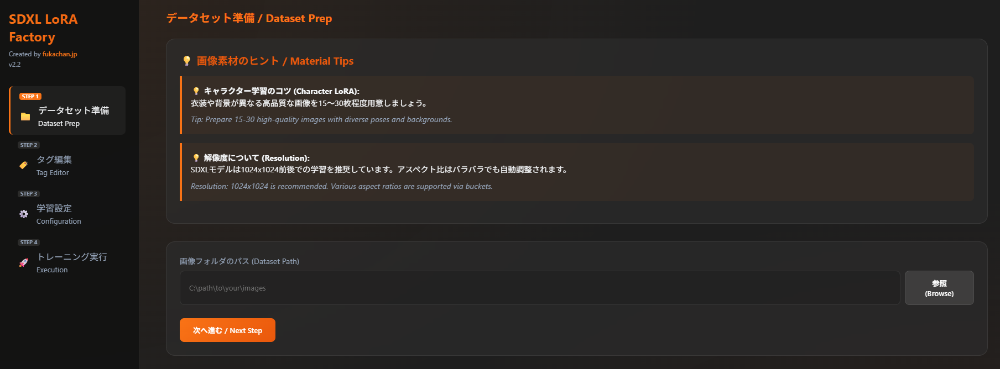

# SDXL LoRA Factory

[English](#english) | [日本語](#japanese)

---

# English

**SDXL LoRA Factory** is a GUI tool designed to make Stable Diffusion XL (SDXL) LoRA training easy and intuitive for everyone.
No complex command-line operations required—it supports everything from image preparation and tagging to training execution in one stop.

## 🌟 Key Features

- **Intuitive UI**: A sleek, modern Grey & Orange design that guides you through the training steps without confusion.
- **Auto-Tagging (WD14 Tagger)**: AI analyzes your image content and automatically generates the tags necessary for training.
- **Visual Tag Editor**: Edit generated tags in real-time while looking at the images. Supports batch addition and removal.
- **SDXL-Specific Optimization**: Pre-configured with settings to maximize SDXL performance, including 1024x1024 resolution, bf16 precision, and gradient checkpointing.
- **VRAM Saving Mode**: Features a "Low VRAM Mode" that allows training on GPUs with as little as 8GB VRAM.
- **One-Click Setup**: Automatically download and set up complex dependencies like `sd-scripts` with a single button click inside the app.

## 🛠️ Requirements

- **OS**: Windows 10/11
- **GPU**: NVIDIA GPU (8GB VRAM or more recommended)
- **Python**: 3.10 or higher
- **Git**: Must be installed

## 🚀 How to Use

1. **Setup**:
   - Run `start.bat` to start the server.
   - Open `http://localhost:8000` in your browser.
   - Click the "Setup Training Engine" button to install dependencies.

2. **Dataset Preparation**:
   - Select the folder containing the images you want to train.
   - Run "Auto-Tagging" and edit tags as needed.

3. **Training Configuration**:
   - Select the Base Model (SDXL) and VAE.
   - Set the number of epochs and learning rate (defaults are recommended for beginners).

4. **Training Execution**:
   - Click "Start Training." Real-time logs will be displayed as the training progresses.

## 📦 Tech Stack

- **Backend**: FastAPI, Python, sd-scripts (kohya-ss)
- **Frontend**: Vanilla JS, CSS (Modern Glassmorphism)
- **Engine**: Stable Diffusion XL

## 📝 License

This project is released under the MIT License.

---

# 日本語

**SDXL LoRA Factory** は、Stable Diffusion XL (SDXL) の LoRA 学習を、誰でも簡単に、直感的な操作で行えるように設計された GUI ツールです。
複雑なコマンドライン操作は不要で、画像の準備からタグ付け、学習の実行までをワンストップでサポートします。

## 🌟 主な特徴

- **直感的な UI**: 洗練されたグレー＆オレンジのモダンなデザインで、学習のステップを迷わず進められます。
- **自動タグ付け (WD14 Tagger)**: AI が画像の内容を分析し、学習に必要なタグを自動で生成します。
- **ビジュアルタグエディタ**: 生成されたタグを画像を見ながらリアルタイムで編集可能。一括追加・削除もサポート。
- **SDXL 特化の最適化**: 1024x1024 解像度、bf16 精度、グラデーション・チェックポインティングなど、SDXL の性能を最大限に引き出す設定がプリセットされています。
- **VRAM 節約モード**: 8GB 程度の VRAM でも学習が可能な「低容量モード」を搭載。
- **ワンクリック・セットアップ**: `sd-scripts` などの複雑な依存関係を、アプリ内からボタン一つで自動取得します。

## 🛠️ 動作要件

- **OS**: Windows 10/11
- **GPU**: NVIDIA GPU (VRAM 8GB 以上推奨)
- **Python**: 3.10 以上
- **Git**: インストール済みであること

## 🚀 使い方

1. **セットアップ**:
   - `start.bat` を実行してサーバーを起動します。
   - ブラウザで `http://localhost:8000` を開きます。
   - 「学習エンジンの自動取得」ボタンをクリックして、依存関係をセットアップします。

2. **データセット準備**:
   - 学習させたい画像が入ったフォルダを選択します。
   - 「自動タグ付け」を実行し、必要に応じてタグを編集します。

3. **学習設定**:
   - ベースモデル (SDXL) と VAE を選択します。
   - エポック数や学習率を設定します（初心者の方はデフォルト推奨）。

4. **トレーニング実行**:
   - 「LoRA学習開始」をクリックすると、リアルタイムでログが表示されながら学習が始まります。

## 📦 技術スタック

- **Backend**: FastAPI, Python, sd-scripts (kohya-ss)
- **Frontend**: Vanilla JS, CSS (Modern Glassmorphism)
- **Engine**: Stable Diffusion XL

## 📝 ライセンス

このプロジェクトは MIT ライセンスの下で公開されています。

---

Created by [fukachan.jp](https://fukachan.jp/)
