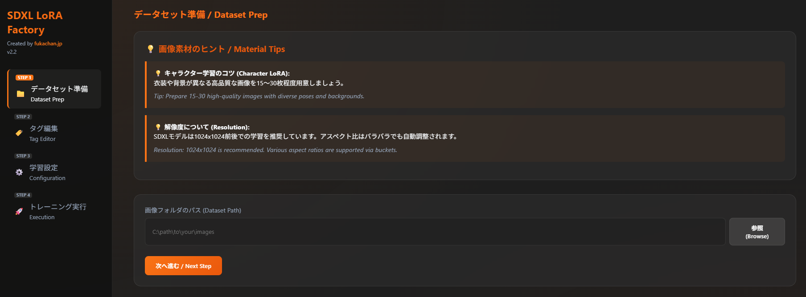

# SDXL LoRA Factory

[English](#english) | [日本語](#japanese)

▼Animaバージョンも公開しています。Anima version is also available. 
[https://github.com/UNfukashigi/Anima-LoRA-Factory](https://github.com/UNfukashigi/Anima-LoRA-Factory)

▼詳しい使い方については、以下の記事をご覧ください。Anima版の説明ですが、基本の使い方は同じです。 
[https://x.com/UNfukashigi/status/2045744319433490449](https://x.com/UNfukashigi/status/2045744319433490449)

> SDXL版は現在、安定版として公開しています。
> 今後はANIMA版を中心に開発を継続し、SDXL版は重大な不具合修正や互換性対応を中心に更新します。
> 修正内容や過去バージョンは、[release](https://github.com/UNfukashigi/SDXL-LoRA-Factory/releases)から確認してください。

---

# English

**SDXL LoRA Factory** is a GUI tool designed to make Stable Diffusion XL (SDXL) LoRA training easy and intuitive for everyone.
No complex command-line operations required—it supports everything from image preparation and tagging to training execution in one stop.

## 🌟 Key Features

- **Intuitive UI**: A sleek, modern Grey & Orange design that guides you through the training steps without confusion.
- **Auto-Tagging (WD14 Tagger)**: AI analyzes your image content and automatically generates the tags necessary for training.
- **Visual Tag Editor**: Edit generated tags in real-time while looking at the images. Supports batch addition and removal.
- **SDXL-Specific Optimization**: Pre-configured with settings to maximize SDXL performance, including 1024x1024 resolution, bf16 precision, and gradient checkpointing.
- **VRAM Saving Mode**: Features a "Low VRAM Mode" that allows training on GPUs with as little as 8GB VRAM.
- **One-Click Setup**: Automatically download and set up complex dependencies like `sd-scripts` with a single button click inside the app.

## 🛠️ Requirements

- **OS**: Windows 10/11
- **GPU**: NVIDIA GPU (8GB VRAM or more recommended)
- **Python**: 3.10 or higher

## 🚀 How to Use

1. **Setup**:
   - Run `start.bat` to start the server.
   - Open `http://localhost:8001` in your browser.

2. **Dataset Preparation**:
   - Select the folder containing the images you want to train.
   - Run "Auto-Tagging" and edit tags as needed.

3. **Training Configuration**:
   - Select the Base Model (SDXL) and VAE.
   - Set the number of epochs and learning rate (defaults are recommended for beginners).

4. **Training Execution**:
   - Click "Start Training." Real-time logs will be displayed as the training progresses.

## 📦 Tech Stack

- **Backend**: FastAPI, Python, sd-scripts (kohya-ss)
- **Frontend**: Vanilla JS, CSS (Modern Glassmorphism)
- **Engine**: Stable Diffusion XL

## 📝 License

This project is released under the Apache License 2.0 License.

---

# 日本語

**SDXL LoRA Factory** は、Stable Diffusion XL (SDXL) の LoRA 学習を、誰でも簡単に、直感的な操作で行えるように設計された GUI ツールです。
複雑なコマンドライン操作は不要で、画像の準備からタグ付け、学習の実行までをワンストップでサポートします。

## 🌟 主な特徴

- **直感的な UI**: 洗練されたグレー＆オレンジのモダンなデザインで、学習のステップを迷わず進められます。
- **自動タグ付け (WD14 Tagger)**: AI が画像の内容を分析し、学習に必要なタグを自動で生成します。
- **ビジュアルタグエディタ**: 生成されたタグを画像を見ながらリアルタイムで編集可能。一括追加・削除もサポート。
- **SDXL 特化の最適化**: 1024x1024 解像度、bf16 精度、グラデーション・チェックポインティングなど、SDXL の性能を最大限に引き出す設定がプリセットされています。
- **VRAM 節約モード**: 8GB 程度の VRAM でも学習が可能な「低容量モード」を搭載。
- **ワンクリック・セットアップ**: `sd-scripts` などの複雑な依存関係を、アプリ内からボタン一つで自動取得します。

## 🛠️ 動作要件

- **OS**: Windows 10/11
- **GPU**: NVIDIA GPU (VRAM 8GB 以上推奨)
- **Python**: 3.10 以上

## 🚀 使い方

1. **セットアップ**:
   - `start.bat` を実行してサーバーを起動します。
   - ブラウザで `http://localhost:8001` を開きます。

2. **データセット準備**:
   - 学習させたい画像が入ったフォルダを選択します。
   - 「自動タグ付け」を実行し、必要に応じてタグを編集します。

3. **学習設定**:
   - ベースモデル (SDXL) と VAE を選択します。
   - エポック数や学習率を設定します（初心者の方はデフォルト推奨）。

4. **トレーニング実行**:
   - 「LoRA学習開始」をクリックすると、リアルタイムでログが表示されながら学習が始まります。

## 📦 技術スタック

- **Backend**: FastAPI, Python, sd-scripts (kohya-ss)
- **Frontend**: Vanilla JS, CSS (Modern Glassmorphism)
- **Engine**: Stable Diffusion XL

## 📝 ライセンス

このプロジェクトは Apache License 2.0 ライセンスの下で公開されています。

---

<code>Further modifications have been made so that the following people can also use it.
People using an NVIDIA GPU that is not the latest model.
People who already have the CPU version of PyTorch installed on their PC.
People whose torchvision has mysteriously disappeared.
People who do not have a GPU (or have an AMD/Intel GPU).</code>

---

Created by [fukachan.jp](https://fukachan.jp/) 

X [https://x.com/UNfukashigi](https://x.com/UNfukashigi)
